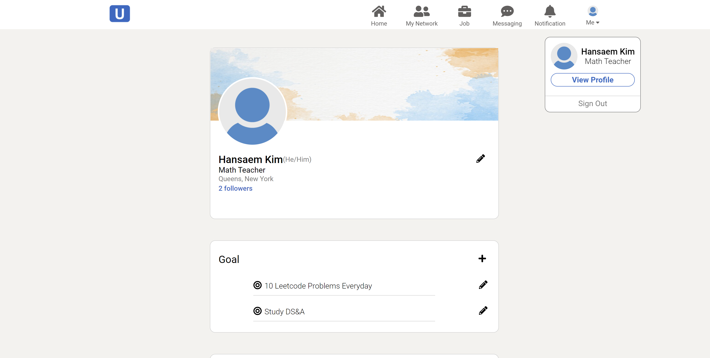
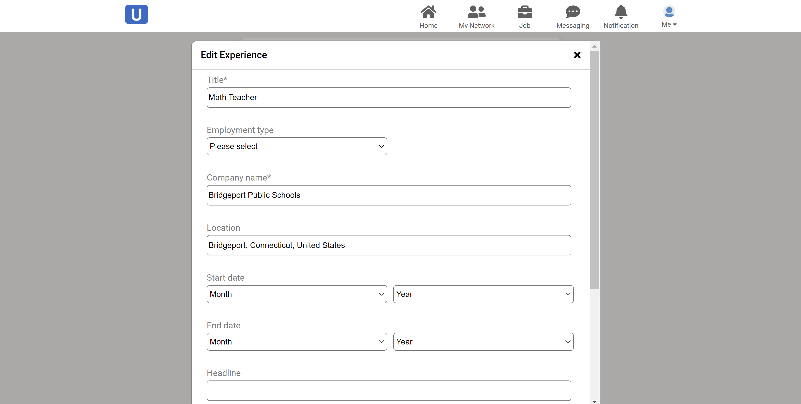
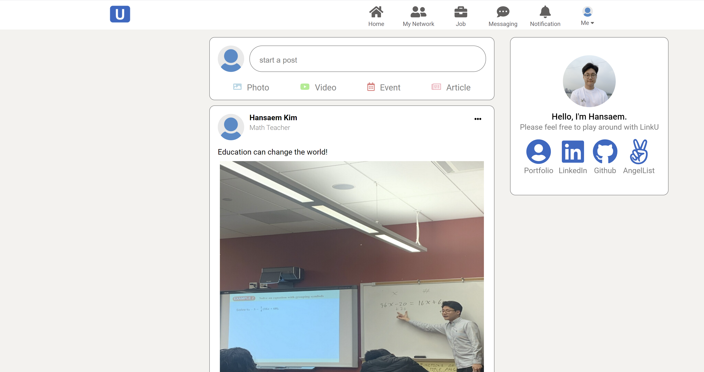
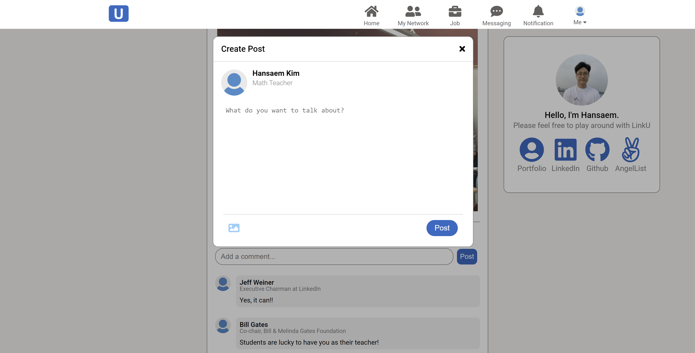

# <p align="center"></p>

## About
LinkU is a clone of LinkedIn, the online service used for professional networking. In LinkU, users can network with other professionals by sharing their information on profile and post/comment on newsfeed.

**Techs Used**: JavaScript, React, Redux, HTML, CSS, jQuery, Rails, JBuilder, PostgreSQL

#### Live Site: [LinkU](https://link-u.herokuapp.com/#/)

## Features
### User Authentication
Users can create an account with basic information. Upon logging-in users have access to additional features such as creating profile, posting, and adding networks.


### Profile
On profile page, users can create or edit their user information, goal, experience, and education.




### Post
Users can write posts on the live feed page. Other users can see the post and write a comment on it.




## Code Snippets
To best practice object-oriented programming, every section of profile page is in its own container.
```javascripts
class Profile extends React.Component{
    constructor(props){
        super(props);
    };

    componentDidMount(){
        this.props.getUsers();
    }

    render(){
        return(
            <div className='profile-div'>
                <section className='sub-section user'>
                    <UserIntro />
                </section>

                <section className='sub-section about'>
                    <AboutIndexContainer />
                </section>

                <section className='sub-section experience'>
                    <ExperienceIndexContainer />
                </section>
                
                <section className='sub-section education'>
                    <EducationIndexContainer />
                </section>

                
            </div>

        )
    }
}
```

Modal.jsx mananges every modal case effectively.
```javascripts
const Modal = (state) => {
    const modal = state.modal;
    if (!modal) return null;
    let component;
    switch(modal){
        case 'createEducation':
            component = <CreateEducationForm />;
            break;
        case 'editEducation':
            component = <EditEducationForm />;
            break;
        case 'createExperience':
            component = <CreateExperienceForm />;
            break;
        case 'editExperience':
            component = <EditExperienceForm />;
            break;
        case 'createAbout':
            component = <CreateAboutForm />;
            break;
        case 'editAbout':
            component = <EditAboutForm />;
            break;
        case 'editUserIntro':
            component = <UserIntroForm />;
            break;
        case 'createPost':
            component = <CreatePostForm />;
            break;
        case 'editPost':
            component = <EditPostForm />;
            break;
        default:
            return null;
    }

    return (
        <div className='modal-div'>
            <div className='modal-component-div' onClick={e => e.stopPropagation()}>
                { component }
            </div>
      </div>
    );
}
```


## In Progress
### Likes

### Search Bar
